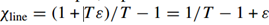
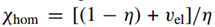
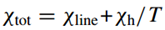

#CV-QKD的安全距离
@(技术类笔记本)[CV-QKD|安全距离]
首先,影响**安全距离**的物理量有: 调制方差Va 、检测器效率η 、电噪声Vel、通信距离L以及信道衰减系数α，通常情况下α为0.2dB/Km。
由于要考虑的是安全距离，那么就必然要考虑窃听者，若值考虑单独攻击(individual attack)和联合攻击(coherent attack)，由此，安全距离的定义为：在窃听者Eve的攻击下，发送者Alice和接受者Bob依然能够使安全密钥率R大于0 。
密钥率通过Alice和Bob之间的互信息I(A:B)以及Eve所能窃听的信息I(B:E)来确定（此处假定系统为反向协商），即：

$$ R=I(A:B)-I(B:E) $$
	
关于individual attack和coherent attack 下Eve能够获取的互信息I(B:E)可以参考论文：“Improvement of continuous-variable quantum key distribution systems by using optical preamplifiers，S Fossier，EDiamanti，2009”
现直接引用结论：
Individual attack 下使用Homodyne检测器时的I(A:B)和I(B:E)分别为：

$$ I_{AB}^{hom}=\frac{1}{2}\log_2\frac{V_B}{B_{B|A}}=\frac{1}{2}\log_2\frac{V+\chi_{tot}}{1+\chi_{tot}} $$

$$ I_{BE}^{hom}=\frac{1}{2}\log_2\frac{V_B}{B_{B|E}}=\frac{1}{2}\log_2\frac{T^2(V+/\chi_{tot})(1/V)+\chi_{line}}{1+T\chi_{hom}(1/V+\chi_{line})} $$
 
其中$V_B=\eta T(V+\chi_{tot})/2$, $B_{B|A}=\eta T(1+\chi_{tot})/2$

公式中的其它参数为：
T表示信道传输系数（信道透过率），给定T和Vel后可以得知Bob端检测器的输入噪声方差为（1+T*Vel）*N0，N0为信道的shot noise，可看成一个单位（调制方差Va的单位也是N0）。
进一步可以计算信道总的加性噪声为
 

当然，系统中除了信道的噪声外还有检测器噪声（这里只分析Homodyne检测器）：

那么总噪声为：

	 
公式中的V=Va+1，Va为Alice的调制方差

信道传输系数T=10^(-0.2*L/10)，L为传输距离，单位为km。

至此，就可以利用上面的式子计算induvidual attack下使用Homodyne检测器时的I(A:B)和I(B:E)了，但是此时已然不能根据上面的R=I(A:B)-I(B:E)>0就判断能够安全通信。这是因为在后处理阶段，通过量子协商算法进行密钥协商时存在协商效率β，因此R的最终表达式应该是：
	R=β*I(A:B)-I(B:E)
	那么，再结合自己的协商算法的效率，便可以知道安全距离能够达到多少了。

高斯调制（CV-QKD）不能远距离分发密钥的主要原因是关联高斯变量的协商在低SNR下非常复杂，目前的技术还不能有效地解决这个难题。
引入离散调制的主要考虑是：BI-AWGN信道中处理协商问题已经有一些有效的方法，因此引入
